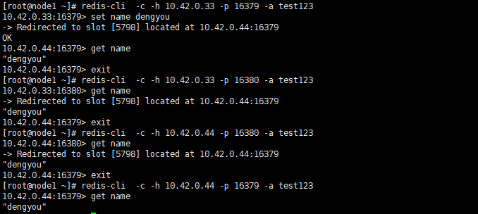

## 环境介绍

用两台虚拟机模拟4个节点，二台机器4个实例，创建出 2 master、2 salve 环境。

| 系统版本 | 软件版本 | 
| ----- | ----- | 
| CentOS7 | redis-3.2.4 |

## 安装过程

### 实例准备

- **下载并解压**
```
~]# yum groupinstall -y "Development tools"
~]# cd /usr/local/src/
src]# wget http://download.redis.io/releases/redis-3.2.4.tar.gz
src]# tar -xf redis-3.2.4.tar.gz 
```

- **编译安装**
```
src]# cd redis-3.2.4
redis-3.2.4]# make && make install
```

- **创建存放多个实例的目录**
```
~]# mkdir -pv /opt/redis-cluster
redis-cluster]# mkdir 16379 16380
redis-cluster]# cp /usr/local/src/redis-3.2.4/redis.conf  16379/
redis-cluster]# cp /usr/local/src/redis-3.2.4/src/redis-server  16379/
redis-cluster]# cp /usr/local/src/redis-3.2.4/redis.conf  16380/
redis-cluster]# cp /usr/local/src/redis-3.2.4/src/redis-server  16380/
```

- **修改redis配置文件**：`%s@16379@16380@g`

- **启动四个实例**
```
16379]# nohup ./redis-server  ./redis.conf &
16380]# nohup ./redis-server ./redis.conf  &
```

### 集群创建

- **执行命令 `redis-trib.rb` 创建集群，这个工具以来Ruby环境需要解决依赖，否则创建集群失败**
```
~]# cp /usr/local/src/redis-3.2.4/src/redis-trib.rb /usr/local/bin/
```
```
~]# yum -y install ruby ruby-devel rubygems rpm-build
```

- **采用rvm来更新ruby环境和版本** - [rvm官网](http://rvm.io/)
```

~]# gpg2 --keyserver hkp://pool.sks-keyservers.net --recv-keys 409B6B1796C275462A1703113804BB82D39DC0E3 7D2BAF1CF37B13E2069D6956105BD0E739499BDB
~]# curl -L get.rvm.io | bash -s stable 
~]# source /usr/local/rvm/scripts/rvm
~]# rvm install 2.3.1
~]# rvm use 2.3.1
```

- **配置gem源** - [gem官网](https://gems.ruby-china.com/)
```
//配置gem源
~]# gem sources --remove https://rubygems.org/
~]# gem sources --add https://gems.ruby-china.com/ 
~]# gem install redis
```
- **修改密码并创建集群**
```
~]# find / -iname "*client.rb"
~]# cp  /usr/local/rvm/gems/ruby-2.3.1/gems/redis-4.1.0/lib/redis/client.rb{,.bak}
~]# vim /usr/local/rvm/gems/ruby-2.3.1/gems/redis-4.1.0/lib/redis/client.rb
 DEFAULTS = {
   ...
   :password => test123,
   ...
 }
~]# redis-trib.rb  create  10.42.0.33:16379 10.42.0.33:16380 10.42.0.44:16379 10.42.0.44:16380
```




